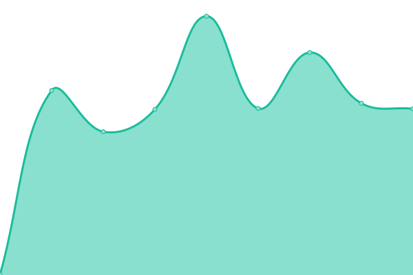
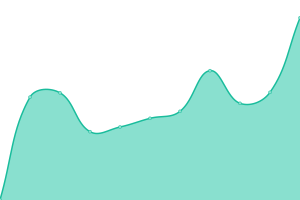
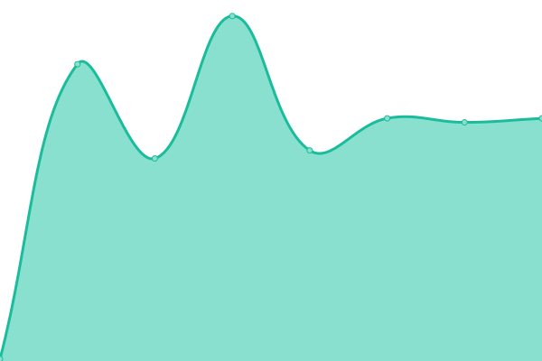
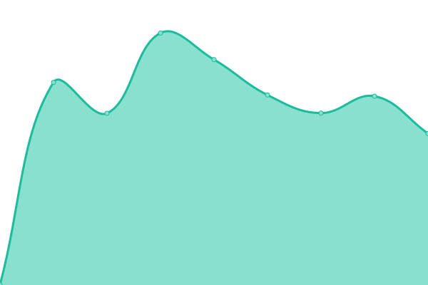

# [📈 Live Status](https://vojeroen.github.io/uptime): <!--live status--> **🟩 All systems operational**

This repository contains the open-source uptime monitor and status page for [vojeroen](https://vojeroen.github.io/uptime), powered by [Upptime](https://github.com/upptime/upptime).

With [Upptime](https://upptime.js.org), you can get your own unlimited and free uptime monitor and status page, powered entirely by a GitHub repository. We use [Issues](https://github.com/vojeroen/uptime/issues) as incident reports, [Actions](https://github.com/vojeroen/uptime/actions) as uptime monitors, and [Pages](https://vojeroen.github.io/uptime) for the status page.

<!--start: status pages-->
<!-- This summary is generated by Upptime (https://github.com/upptime/upptime) -->
<!-- Do not edit this manually, your changes will be overwritten -->
<!-- prettier-ignore -->
| URL | Status | History | Response Time | Uptime |
| --- | ------ | ------- | ------------- | ------ |
|  Bitwarden | 🟩 Up | [bitwarden.yml](https://github.com/vojeroen/uptime/commits/HEAD/history/bitwarden.yml) | 

 1171ms
     
 | 

<a href="https://vojeroen.github.io/uptime/history/bitwarden">100.00%</a>
    

|  Chat (element) | 🟩 Up | [chat-element.yml](https://github.com/vojeroen/uptime/commits/HEAD/history/chat-element.yml) | 

 1001ms
     
 | 

<a href="https://vojeroen.github.io/uptime/history/chat-element">100.00%</a>
    

|  Chat (synapse) | 🟩 Up | [chat-synapse.yml](https://github.com/vojeroen/uptime/commits/HEAD/history/chat-synapse.yml) | 

 981ms
     
 | 

<a href="https://vojeroen.github.io/uptime/history/chat-synapse">100.00%</a>
    

|  Git | 🟩 Up | [git.yml](https://github.com/vojeroen/uptime/commits/HEAD/history/git.yml) | 

 841ms
     
 | 

<a href="https://vojeroen.github.io/uptime/history/git">100.00%</a>
    

|  Home assistant | 🟩 Up | [home-assistant.yml](https://github.com/vojeroen/uptime/commits/HEAD/history/home-assistant.yml) | 

 1081ms
     
 | 

<a href="https://vojeroen.github.io/uptime/history/home-assistant">100.00%</a>
    

|  Mail IMAP | 🟩 Up | [mail-imap.yml](https://github.com/vojeroen/uptime/commits/HEAD/history/mail-imap.yml) | 

 138ms
     
 | 

<a href="https://vojeroen.github.io/uptime/history/mail-imap">100.00%</a>
    

|  Mail SMTP delivery | 🟩 Up | [mail-smtp-delivery.yml](https://github.com/vojeroen/uptime/commits/HEAD/history/mail-smtp-delivery.yml) | 

 115ms
     
 | 

<a href="https://vojeroen.github.io/uptime/history/mail-smtp-delivery">100.00%</a>
    

|  Mail SMTP submission | 🟩 Up | [mail-smtp-submission.yml](https://github.com/vojeroen/uptime/commits/HEAD/history/mail-smtp-submission.yml) | 

 139ms
     
 | 

<a href="https://vojeroen.github.io/uptime/history/mail-smtp-submission">100.00%</a>
    

|  Nextcloud | 🟩 Up | [nextcloud.yml](https://github.com/vojeroen/uptime/commits/HEAD/history/nextcloud.yml) | 

 1332ms
     
 | 

<a href="https://vojeroen.github.io/uptime/history/nextcloud">100.00%</a>
    

|  Projects | 🟩 Up | [projects.yml](https://github.com/vojeroen/uptime/commits/HEAD/history/projects.yml) | 

 693ms
     
 | 

<a href="https://vojeroen.github.io/uptime/history/projects">100.00%</a>
    

|  Timetracker | 🟩 Up | [timetracker.yml](https://github.com/vojeroen/uptime/commits/HEAD/history/timetracker.yml) | 

 1146ms
     
 | 

<a href="https://vojeroen.github.io/uptime/history/timetracker">99.80%</a>
    

<!--end: status pages-->

[**Visit our status website →**](https://vojeroen.github.io/uptime)

## 📄 License

- Powered by: [Upptime](https://github.com/upptime/upptime)
- Code: [MIT](./LICENSE) © [vojeroen](https://vojeroen.github.io/uptime)
- Data in the `./history` directory: [Open Database License](https://opendatacommons.org/licenses/odbl/1-0/)
